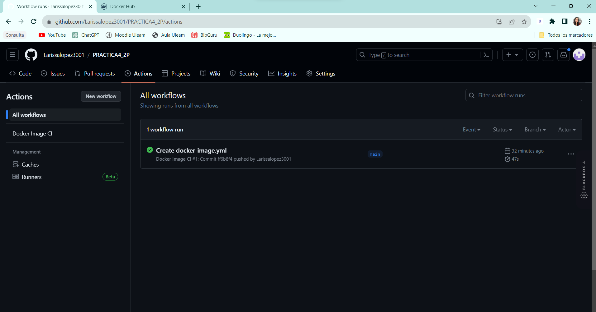
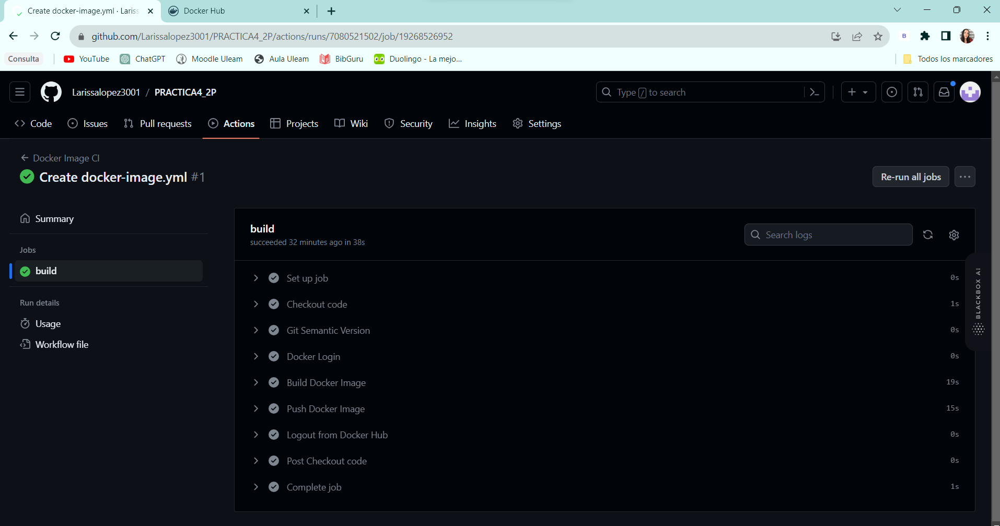

# Práctica 4 
### Dockerización de Aplicación NestJS y GitHub Actions

Esta práctica sirve como guía para Dockerizar una aplicación NestJS y establecer un flujo de trabajo automatizado mediante GitHub Actions. Con este enfoque, podrás construir y desplegar contenedores Docker de manera eficiente.

### Pasos a seguir:
***
### 1. Repositorio  
Crear repositorio en este caso PRACTICA4_2P


### 2. Preparar el código fuente.

Posteriormente, simplemente llevamos a cabo la confirmación del código que se utilizará.


### 3. Establecer la configuración de secrets en GitHub. 

Crea los secrets "DOCKER_USER" y "DOCKER_PASSWORD" en la sección de Secrets de tu repositorio en GitHub.


### 4. Configurar el token de Docker Hub. 

Utiliza tu nombre de usuario y la clave (token) de Docker Hub para completar los secrets "DOCKER_USER" y "DOCKER_PASSWORD". Crea un token en Docker con el nombre "Github-Actions" y copia este token generado en el secret "DOCKER_PASSWORD".


### 5. Dockerización de la aplicación

Crear un contenedor Docker para tu aplicación NestJS (idealmente, un servicio REST o GraphQL sin dependencias).


### 6. Comprobar la construcción y operatividad. 

Comprobar que la imagen pueda ser compilada mediante el siguiente comando:
```
 docker login
```
```
 docker build -t larissalopez3001/webhooks:latest. 
 ```
 Confirma el correcto funcionamiento de la aplicación.


### 7. Confirmación

Finalmente, realizamos la confirmación para permitir que los builds se realicen automáticamente cada vez que se realice un nuevo commit en el repositorio.


### 8. Crear la acción de la imagen Docker
Establece un flujo de trabajo en GitHub Actions para generar la imagen Docker utilizando el archivo docker-image.yml.


# Evidencias de la práctica

Cuando guardamos estos cambios, se generará automáticamente una nueva construcción (build).



